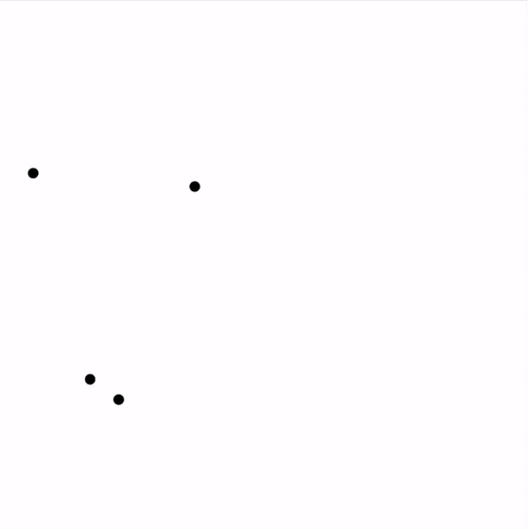
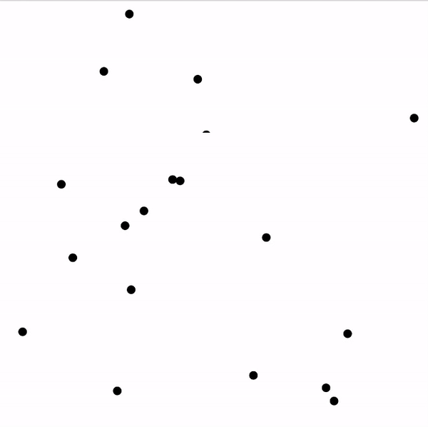

# BouncingBalls

A particle simulation program written in java as practices.
(only collision with walls is enabled so far. collision between particles will be enabled in future.)

Prioity queue forms skeleton of this program making it event-driven.

TimerTask schedule the taskes updating the images periodically.

So far, TimerTask could cause data race when there are too many particles.

